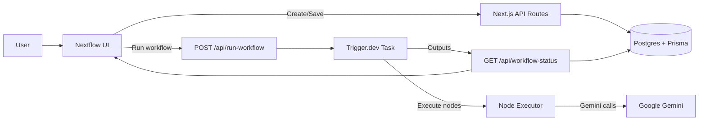

# Nextflow

Nextflow is a visual studio for AI workflows. It combines a React Flow based editor, a Trigger.dev execution layer, and Prisma persistence so you can design, run, and inspect multimodal pipelines end to end.

## Tech stack

- Next.js 16 (App Router)
- React 19 + TypeScript
- React Flow for the node editor and canvas interactions
- Trigger.dev v4 for workflow execution
- Prisma + PostgreSQL (Neon-compatible) for persistence
- Clerk for authentication
- Gemini via `@google/generative-ai`
- Zustand for client-side workflow state
- Tailwind CSS v4 + Radix UI for UI primitives

## Product flow (high level)

1. Users create or open a workflow in the editor.
2. The editor stores nodes and edges in Postgres via the workflow API.
3. When a run is triggered, the backend starts a Trigger.dev task.
4. The task executes nodes in topological order and collects outputs.
5. The UI polls for run status and streams LLM output into the node UI.
6. Completed outputs are persisted to the `Run` table.

## Workflow execution flow (detailed)

1. **Create or load**
	- `POST /api/workflows` creates a new workflow.
	- `GET /api/workflows` lists workflows for the authenticated user.
	- `GET /api/workflows/[workflowId]` loads nodes and edges.

2. **Save changes**
	- `POST /api/workflows/[workflowId]` saves nodes + edges (replace all).

3. **Run**
	- `POST /api/run-workflow` triggers the Trigger.dev task with `workflowId`.

4. **Execute**
	- `src/trigger/example.ts` loads the workflow, orders nodes, and runs each node type.
	- LLM nodes call Gemini with a composed prompt (inputs + system + user prompt).
	- Outputs are stored in a per-node map keyed by node id.

5. **Poll + stream**
	- `GET /api/workflow-status?runId=...` returns run status + outputs.
	- The UI streams LLM output into each LLM node with a typing effect.

6. **Persist**
	- Completed runs are upserted into `Run` with status, output, and error logs.

## System flow (structure)



## Node types

Supported node types in the editor and executor:

- `text`: plain text input or prompt seed
- `image`: image input (base64 or URL)
- `video`: video input (URL)
- `frame`: frame extraction placeholder output
- `crop`: cropped image output
- `llm`: Gemini generation based on inputs + prompts

## API routes

Workflow CRUD (authenticated via Clerk):

- `POST /api/workflows` create a workflow
- `GET /api/workflows` list workflows
- `GET /api/workflows/[workflowId]` get workflow nodes/edges
- `POST /api/workflows/[workflowId]` save nodes/edges
- `PATCH /api/workflows/[workflowId]` rename workflow
- `DELETE /api/workflows/[workflowId]` delete workflow
- `POST /api/workflows/[workflowId]/duplicate` duplicate workflow

Run execution:

- `POST /api/run-workflow` trigger a run
- `GET /api/workflow-status` poll run status + outputs

## Data model

Prisma models are defined in [prisma/schema.prisma](prisma/schema.prisma):

- `Workflow`: container for nodes, edges, and runs
- `Node`: React Flow node with position + data JSON
- `Edge`: React Flow edge with handles + style JSON
- `Run`: execution output + status for a workflow

## Trigger.dev

- Config: [trigger.config.ts](trigger.config.ts)
- Task: [src/trigger/example.ts](src/trigger/example.ts)
- Default model: `gemini-2.0-flash` (configurable in the task)

Run the Trigger.dev dev server in a separate terminal during local development.

## Environment variables

Create a local `.env` with the following keys (values omitted here):

```
NEXT_PUBLIC_CLERK_PUBLISHABLE_KEY=
CLERK_SECRET_KEY=
DATABASE_URL=
TRIGGER_SECRET_KEY=
GEMINI_API_KEY=
```

`GEMINI_API_KEY` can also be provided as `GOOGLE_API_KEY`.

## Local development

1. Install dependencies
	```bash
	npm install
	```

2. Sync the database schema (no migrations in this repo)
	```bash
	npx prisma db push
	```

3. Generate Prisma client
	```bash
	npx prisma generate
	```

4. Start Next.js
	```bash
	npm run dev
	```

5. Start Trigger.dev in another terminal
	```bash
	npx trigger.dev@latest dev
	```

## Scripts

- `npm run dev`: Start Next.js dev server (Webpack)
- `npm run build`: Generate Prisma client and build Next.js
- `npm run start`: Start production server
- `npm run lint`: Linting is currently disabled

## Notes

- Type checking and ESLint are disabled during builds in [next.config.ts](next.config.ts).
- Prisma client is generated to `src/generated/prisma`.
- React Flow attribution is hidden in the editor canvas.

## Project structure

- `src/app` - App Router pages and API routes
- `src/app/(pages)/workflow` - editor UI, canvas, nodes, and interactions
- `src/app/api` - workflow CRUD and run execution APIs
- `src/trigger` - Trigger.dev tasks
- `src/lib` - Prisma client and workflow API helpers
- `src/store` - Zustand workflow store
- `prisma` - database schema
- `public/landing` - landing page assets
